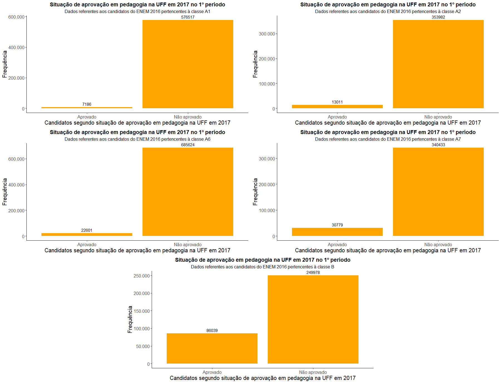

# Consultoria_ENEM
 O pesquisador Renato Dias entrou em contato com a PIXRJ para realização de uma consultoria sobre os microdados do ENEM.
 
# Observação
 Esta consultoria é parte da matéria estatística aplicada. Onde o objetivo é aplicar o conhecimento adquirido durante o curso de estatística realizando consultorias que será apresentada e avaliada pelo professor.
 
 # Introdução
 Nesta consultoria temos o objetivo de traçar o perfil dos participantes do ENEM 2016, que obedeciam a características de interesse selecionadas pelo cliente, que estariam aptos a ingressar no curso de Pedagogia na UFF na primeira chamada do ENEM 2017. Na seção 1 descrevemos o universo de estudo e a forma como foram tratados os dados, enviados pelo cliente. Na seção 2 apresentamos uma análise descritiva dos dados coletados e, por fim, na seção 3 tecemos nossas conclusões sobre o problema abordado.
 
 O problema apresentado inicialmente era gerar análises sobre os candidatos do ENEM 2016, ou seja, trabalhar com um grande volume de dados. 

 A primeira etapa foi limpar o banco de dados, mantendo o registro apenas dos candidatos que obedeciam as características de interesse, definidas pelo cliente, sendo estes os candidatos:
* Pertencentes à Região Sudeste;
* Que participaram dos dois dias de prova;
* Que não estavam fazendo ENEM apenas como treino;
* Aptos a realizar o SISU, ou seja, que já terminaram ou que terminariam o ensino médio em 2016.

 A segunda etapa foi selecionar as características sociodemográficas predeterminadas pelo cliente, além de adicionar a característica sobre a Unidade Federativa do candidato.
* Raça;
* Sexo;
* Idade;
* Tipo de escola que frequentou durante o ensino médio;
* Números de pessoas que moram na mesma casa;
* Escolaridade da mãe;
* Situação de trabalho remunerado;
* Unidade Federativa.

 O cliente anseia separar os candidatos aprovados no curso de pedagogia da UFF na primeira chamada do ENEM 2017 e a população geral, que seriam todos os candidatos restantes após os tratamentos da primeira etapa. Para tal, foi criado uma variável sobre a cota do participante, com ajuda da tabela que está no Anexo 1, como auxílio, a característica sobre a renda familiar foi utilizada. 

 Para criar a variável sobre aprovação, foi necessário a seleção das variáveis que contém as notas de cada prova. Sabendo a cota do candidato, e considerando que cada um só pode participar de uma cota, foi criado a variável de aprovados e não aprovados. Os candidatos aprovados deveriam possuir nota superior à nota de corte, além de nota superior à mínima para cada prova. A nota de corte é baseada na fórmula disponível no Anexo 1 e as notas mínimas para cada prova são apresentadas na tabela no Anexo 2.

# Análises e resultados

 O conjunto de dados originalmente tinha quase 9 milhões de observações e mais de 100 variáveis. Após os tratamentos, a base ficou com informações de 1.627.945 candidatos, que compõem a população geral, e 14 características sócio-demográficas sobre cada um deles.
 Pela Figura 1 pode-se observar a diferença, já esperada, da quantidade de candidatos com “passaporte” para a aprovação e os que não foram aprovados, pelo menos na primeira chamada. Dos 1.627.945 candidatos de interesse, 159.616 deles estavam com “passaporte” de aprovação para o curso de Pedagogia na UFF em 2017.

 Na Figura 2, é possível notar que, proporcionalmente, a classe de Ampla Concorrência (B) é a que possui maior índice de aprovação (25,6%). Isto pode indicar que as características que influenciam cada cota, como renda, raça e escola que frequentou durante o ensino médio podem afetar na aprovação do candidato.

 
 A escolaridade da mãe parece, em determinados casos, afetar a chance de um candidato ser aprovado. Na Figura 3, nota-se que candidatos cuja mãe completou a faculdade, mas não completou a pós-graduação, estão muito mais presentes entre os aprovados, assim como as mães que completaram a pós-graduação. Já candidatos que a mãe possui ensino fundamental incompleto estão mais presentes na população geral. O que pode indicar que a escolaridade da mãe afeta o desempenho do candidato no ENEM.

 Pela Figura 4 percebe-se que a maioria dos candidatos são da raça branca, seguido por parda, e também há uma diminuição da raça branca na população geral ao se comparar os aprovados em pedagogia. Isso pode indicar que brancos têm maior chance de serem aprovados. Destaca-se que, em ambos os casos, poucos candidatos não dispõem da informação de sua raça, o que parece ser insignificante na análise.

 Em termos de proporção, aparentemente, pela Figura 5, homens têm maior probabilidade de serem aprovados em pedagogia. Isto é, em termos relativos, há mais homens entre os aprovados do que homens na população geral.

 Aparentemente, candidatos que frequentaram somente escolas privadas durante o ensino médio, têm maior chance de serem aprovados em pedagogia. Dentre os candidatos que estudaram na escola privada, os que não tem bolsa de estudo integral têm maior porcentagem de aprovação do que os candidatos com bolsa integral. Este fato pode ser observado na Figura 6. Vale ressaltar que para cada tipo de escola que o candidato frequentou o ensino médio há uma frequência diferente, sendo estas n1= 1.291.928, n2= 50.278, n3= 21.114, n4= 212.835, n5= 51.790,  da esquerda para direita, respectivamente. Com isso, quem estudou somente em escola pública (1.291.928 candidatos) possui 94% de não aprovados.

 
 Observando a Figura 7, nota-se que há uma certa disparidade entre quem trabalhou ou trabalha e os candidatos que nunca trabalharam, dentre os aprovados, onde quem nunca trabalhou está muito mais presente. Já dentre a população geral esta disparidade não é tão perceptível.

 Analisando a Figura 8, a tendência, aparentemente, é que mães de candidatos que não completaram o ensino médio ou possuem nível de ensino inferior a esse possuem, em média, mais residentes na mesma casa na população geral se comparada aos aprovados. Já para os outros níveis de escolaridade da mãe do candidato as diferenças entre os grupos são menos perceptíveis.

 Há alguns insights que podem ser percebidos na Figura 9, como o fato de pessoas acima de 50 anos estarem muito mais presentes na população geral do que dentre os aprovados. Percebe-se também que a maioria dos candidatos tem entre 15 a 25 anos, e apenas 3.231 candidatos têm acima de 60 anos, o que representa menos de 0,2% da população total.

 Considerando as Unidades Federativas dos candidatos, com o 1º período relativo às observações em azul e o 2º período para aquelas em vermelho, nota-se que em geral no 2º período há menos ingressantes que no 1º período (Figura 10). Também percebe-se que para o estado de Minas Gerais, existe uma diferença grande entre aprovados em cada uma das chamadas, o que não ocorre para o Espírito Santo.

 As principais análises que são geradas através da Figura 11, são a predominância de brancos que frequentaram apenas escolas privadas. Já para aqueles que cursaram o ensino médio somente em escolas públicas, pretos e pardos aparentam, proporcionalmente, estarem em maior presença. Vale ressaltar que para cada tipo de escola que o candidato frequentou o ensino médio há uma frequência diferente. Para os aprovados, estas são n1= 73.577, n2= 4.887, n3= 1.773, n4= 67.292, n5= 12.087, da direita para a esquerda, respectivamente.

 Aparentemente, pela Figura 12, a situação de trabalho remunerado segue o mesmo padrão independente do grau de escolaridade da mãe do candidato, isto é, candidatos que nunca trabalharam tendem a possuir, em média, mais pessoas em sua casa do que os outros candidatos.

 
 Na Figura 13, é possível notar que os candidatos que nunca trabalharam têm média de idade bem menor que os candidatos que já trabalharam ou estão trabalhando até o momento do exame.

# Conclusão

 Diante dos resultados apresentados, pode-se chegar a algumas conclusões sobre perfil de aprovados e como se diferencia da população geral, com isso podendo gerar insights que poderão ajudar a diminuir a discrepância entre esses perfis.
 
 Os candidatos com “passaporte” de aprovação apresentaram nas variáveis socio-demográficas as características predominantes de raça branca, sexo feminino, escolaridade da mãe que completou o Ensino Médio, mas não a Faculdade e tipo de ensino médio cursado em escola privada sem bolsa de estudo integral e que nunca trabalhou remuneradamente, com idade entre 15 a 25 anos.
 
 Entre as análises cruzadas efetuadas, destaca-se que os candidatos na condição que nunca trabalharam apresentam maior número de indivíduos em sua residência que as demais categorias. E como visto, candidatos que nunca trabalharam aparentam ter mais chance de serem aprovados.
 
 Podemos concluir que entre os aprovados para o curso de Pedagogia na UFF na 1ª chamada do SISU de 2017, brancos, alunos que estudaram integralmente em escola particular e candidatos que nunca trabalharam parecem possuir certa "vantagem'' diante da “concorrência” na hora de obter a aprovação. Isto evidencia certas discrepâncias na população de interesse do Sudeste do Brasil, principalmente entre a raça e o tipo de escola que frequentou o ensino médio.
 
 Medidas que podem ajudar a controlar essa diferença, são ações do governo com fins educacionais e de conscientização, como melhoria da educação em escolas públicas, ajuda financeira a jovens de baixa renda, o que possivelmente diminuiria a necessidade de muitos trabalharem e também campanhas para incentivar a conclusão do ensino médio e a realização do ENEM, ainda com conhecimentos “frescos”.
 
 Também é sabido que no Brasil a evasão escolar é muito alta, principalmente em escolas públicas, seria de interesse realizar monitoramento e incentivo a conclusão do ensino médio, assim gerando mais candidatos aptos a prestarem o SISU.

# Anexo 1
Pedagogia – 2017
Fórmula de cálculo =  (R*2 + CNT + CHT*2 + LCT + MT)/7
Modalidade: licenciatura
Turno: integral

| Prova do ENEM          |  Peso               |    Nota mínima    |
| -------------------    | ------------------- |-------------------|
|  Redação (R)           |  2                  | 300
|  Ciências da Natureza e suas Tecnologias (CNT) | 1 |300                |
|Ciências Humanas e suas Tecnologias (CHT)| 2 | 350 |
|Linguagens, Códigos e suas Tecnologias (LCT) | 1 | 300 |
|Matemática e suas Tecnologias (MT)| 1 | 250|

# Anexo 2
|Chamada/Semestre|Modalidade |Nota |
|---------------|-----------|---------|
|Primeira/Primeiro|B|661,34|
|Primeira/Primeiro|A1|635,91|
|Primeira/Primeiro|A2|620,97|
|Primeira/Primeiro|A6|654,47|
|Primeira/Primeiro|A7|629,21|
|Quinta/Segundo|B|625,81|
|Quinta/Segundo|A1|612,20|
|Quinta/Segundo|A2|588,24|
|Quarta/Segundo|A6|619,39|
|Quinta/Segundo|A7|586,84|

